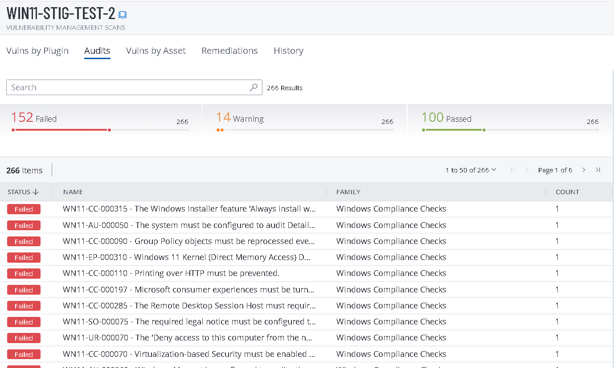

# Windows 11 STIG Remediation & Baseline

This repository focuses on **remediating and hardening Windows 11 systems** using **DISA Security Technical Implementation Guides (STIGs)** with an emphasis on **Group Policy Object (GPO)**–based enforcement and automation.

---

## 🛡️ What is a DISA STIG?

The **Defense Information Systems Agency (DISA)** publishes Security Technical Implementation Guides (STIGs) that define secure configuration standards for operating systems, applications, and network devices.

The **Windows 11 STIG** provides:
- Security baselines aligned with DoD and NIST 800-53 controls
- Prescriptive remediation steps
- Audit and validation requirements

STIGs are commonly enforced using:
- Group Policy Objects (GPOs)
- Mobile Device Management (MDM)
- Local Group Policy (LGPO)

---

## 🎯 Project Objectives

- Implement **Windows 11 STIG remediations**
- Apply and validate **STIG GPO baselines**
- Document remediation logic and enforcement methods
- Support **repeatable and auditable compliance**

---

## Source Documentation

Authoritative STIG guidance and examples are sourced from:

- **DISA STIG GPO Downloads**  
  https://www.cyber.mil/stigs/gpo/

- **SecureStrux STIG & GPO Blogs**  
  https://github.com/SecureStrux/Blogs

  ---

## 📁 Repository Structure

```text
├── docs/
│   ├── STIG_OVERVIEW.md
│   └── Windows11_STIG_controls.xlsx
└── README.md
```

## STIG Controls

| STIG ID | Category | Control Description |
|--------|----------|---------------------|
| WN11-CC-000063 | Configuration | Windows 11 must be configured to use Group Policy or approved MDM |
| WN11-CC-000090 | Configuration | GPOs must be reprocessed even if they have not changed |
| WN11-CC-000120 | Configuration | Insecure guest logons must be disabled |
| WN11-SO-000005 | Security Options | Built-in Administrator account must be disabled |
| WN11-SO-000020 | Security Options | Built-in Administrator account must be renamed |
| WN11-SO-000025 | Security Options | Built-in Guest account must be disabled |
| WN11-SO-000030 | Security Options | Built-in Guest account must be renamed |
| WN11-SO-000070 | Security Options | Account lockout threshold must be configured |
| WN11-SO-000075 | Security Options | Account lockout duration must be configured |
| WN11-SO-000080 | Security Options | Account lockout reset time must be configured |
| WN11-UR-000060 | User Rights | Create symbolic links must be restricted to Administrators |
| WN11-UR-000080 | User Rights | Deny access to this computer from the network must be configured |
| WN11-UR-000090 | User Rights | Deny log on locally must be configured |
| WN11-UR-000100 | User Rights | Deny log on through Remote Desktop Services must be configured |
| WN11-UR-000120 | User Rights | Load and unload device drivers must be restricted |
| WN11-UR-000140 | User Rights | Modify firmware environment values must be restricted |
| WN11-AU-000505 | Auditing | Audit Credential Validation (Success and Failure) must be enabled |
| WN11-AU-000510 | Auditing | Audit Application Group Management must be enabled |
| WN11-AU-000555 | Auditing | Audit Other Policy Change Events (Failure) must be enabled |
| WN11-FW-000010 | Firewall | Windows Firewall must be enabled for all profiles |



## Applying STIGs Using Group Policy
Download the Windows 11 STIG GPO package from DISA

Open Group Policy Management Console (GPMC)

Import the STIG GPO into the domain

Link the GPO to the appropriate Organizational Unit (OU)

Some STIGs require additional ADMX templates (for example, SecGuide.admx) to be installed in the Group Policy Central Store before import.

## Local Policy Enforcement (LGPO)
For standalone or lab systems, Microsoft’s LGPO.exe can be used to apply STIG GPOs locally.

Backup existing local policy

```.\LGPO.exe /b C:\GPO-Backup```

Apply STIG GPO locally

```.\LGPO.exe /g ".\Windows11-STIG-GPO"```

## Compliance Validation
Compliance and validation can be performed using:

STIG Viewer

SCAP Compliance Checker (SCC)

PowerShell auditing scripts

InSpec Windows 11 STIG baselines


## References
DISA STIGs and GPOs

https://www.cyber.mil/stigs/gpo/

SecureStrux Blogs

https://github.com/SecureStrux/Blogs

STIG Viewer

https://public.cyber.mil/stigs/
